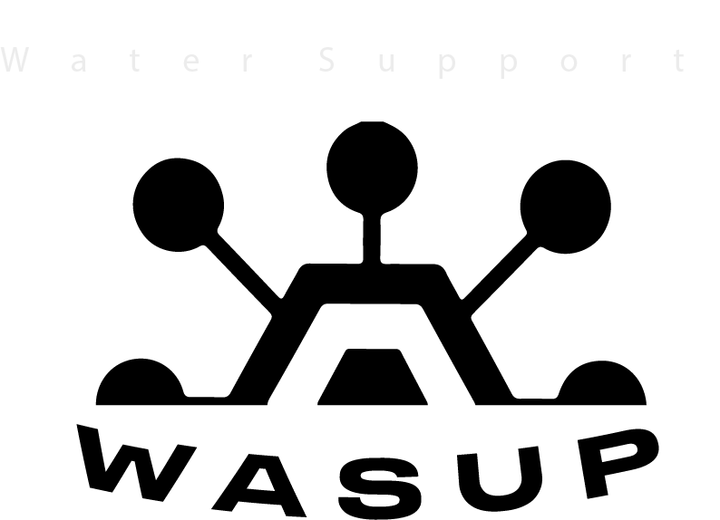

<p align="center">
  <a>
    
  </a>
</p>
<p align="center">
    <a href="https://github.com/gear-tech/gear-js/blob/master/LICENSE"></a>
</p>
<hr>

## Description
Smart contract made for the Water Support dApp, using the template for NFT provided by the gear team.

## Building Locally

### ⚙️ Install Rust

```shell
curl --proto '=https' --tlsv1.2 -sSf https://sh.rustup.rs | sh
```

### ⚒️ Add specific toolchains

```shell
rustup toolchain add nightly
rustup target add wasm32-unknown-unknown --toolchain nightly
```

### 🏗️ Build

```shell
cargo build --release
```

## License

The source code is licensed under the [MIT license](LICENSE).
